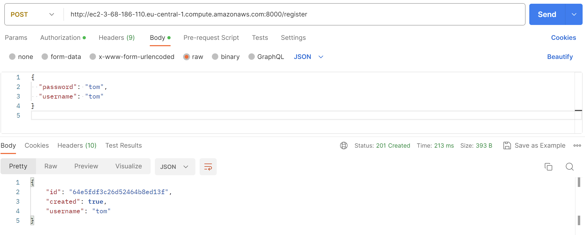
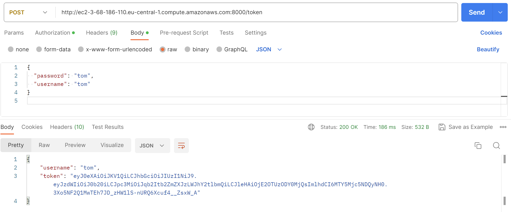
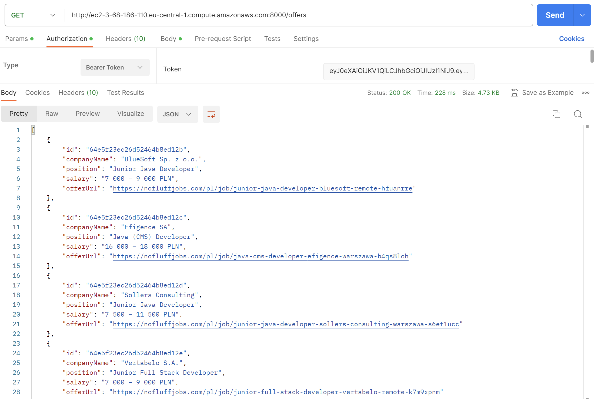
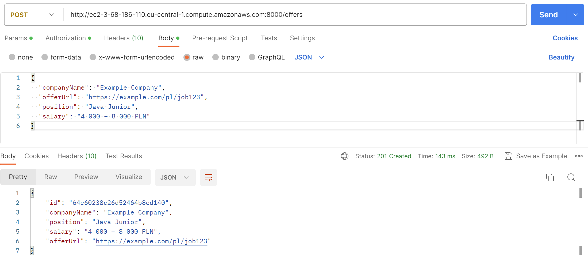
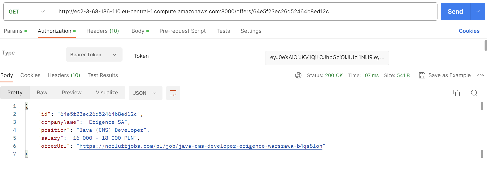
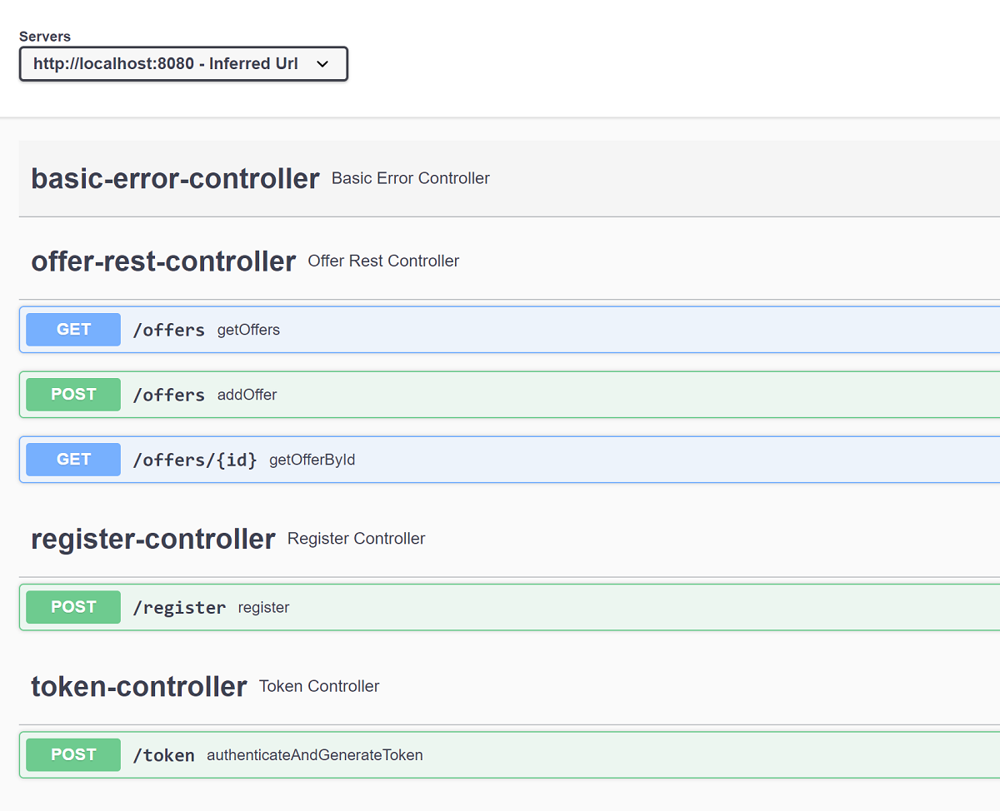

## My Job Offers

Live Demo do Swaggera aplikacji umieszczonej na AWS dostępne pod linkiem:
http://ec2-3-68-186-110.eu-central-1.compute.amazonaws.com:8000/swagger-ui/index.html#
Najpierw należy zarejestrować użytkownika, potem uzyskać token dla tego użytkownika, a następnie kliknąć Authorize i wkleić token dostępu do endpointów offers.


Aplikacja pobierająca z zewnętrznego API listę najnowszych ogłoszeń o pracę dla Java Junior Developerów.
Ogłoszenia są cyklicznie pobierane przy użyciu schedulera, filtrowane a następnie bez duplikatów zapisywane w bazie danych.
W celach edukacyjnych i rozwojowych starałem sie zrobić tem projekt trochę inaczej niż pozostałe, dlatego użyłem innej bazy danych - MongoDB, wykorzystałem też Dockera i Spring Security, oraz zrobiłem porządne testy. 

Projekt wykonany pod okiem mentora, prezentuje moje aktualne możliwości i poziom zawansowania w IT. Może jeszcze nie wszystko potrafię ale rozwijam się systematycznie.
Jestem dumny z miejsca w którym jestem. Jeszcze rok temu nie potrafiłem nic sam napisać w Javie a dziś... robię to co lubię, na luzie i z satysfakcją. 


## Technologie wykorzystane w projekcie:

- Spring Boot: Web (RestControllers), Test, Data Mongodb, Validation, Security + JWT
- baza danych MongoDB + Mongo-Express na porcie 8081, do przeglądania zawartości bazy danych
- Redis do Cache + Redis-Commander na porcie 8082
- Spring Scheduler - pobierający co 3 godziny najnowsze oferty pracy
- Docker & Docker-Compose & Docker Desktop
- Wiremock
- Log4j2
- Testcontainers
- RestTemplate, json, HTTP, MockMvc
- Awaitility
- Testy Jednostkowe (JUnit5, Mockito, AssertJ)
- Testy Integracyjne SpringBootTest, MockMvc, SpringSecurityTest
- Lombok
- Maven
- Git, Github/Gitlab
- Swagger

## Uruchomienie aplikacji:

- sklonować najnowszą wersję repozytorium 
- uruchomić plik docker-compose.yml
- uruchomić metodę main w klasie MyJobOffersSpringBootApplication.

 

## Zachęcam też do testowania w Postmanie.

W pierwszej kolejności musimy zarejestrować użytkownika podając swoje dane. Należy zrobić  POST z odpowiednim JSON  na “/register” czyli:
http://ec2-3-68-186-110.eu-central-1.compute.amazonaws.com:8000/register
````
{
"password": "your_password",
"username": "your_username"
}
````

#
 

Gdy jesteśmy już zarejestrowani, musimy uzyskać token. Robimy POST na “/token” , podając dane z rejestracji, czyli: http://ec2-3-68-186-110.eu-central-1.compute.amazonaws.com:8000/token
````
{
"password": "your_password",
"username": "your_username"
}
````
W odpowiedzi uzyskujemy token.

#
 

Następnie możemy już pobrać oferty pracy robiąc GET na “/offers” podając w nagłówku nasz autoryzacyjny bearer token

#
 

Możemy też dodać nasze ogłoszenie do bazy danych. W tym celu robimy POST na “/offers”,
http://ec2-3-68-186-110.eu-central-1.compute.amazonaws.com:8000/offers  podając w nagłówku nasz autoryzacyjny bearer token oraz dodając request body:
````
{
"companyName": "Example Company",
"offerUrl": "https://example.com/pl/job123",
"position": "Java Junior",
"salary": "4 000 – 8 000 PLN"
}
````

#
 

Możemy też pobrać ofertę pracy z bazy danych po id:

# 
 

Swagger:




### Autor: 
Grzegorz Gawrysiak 

linkedin.com/in/gawrysiak